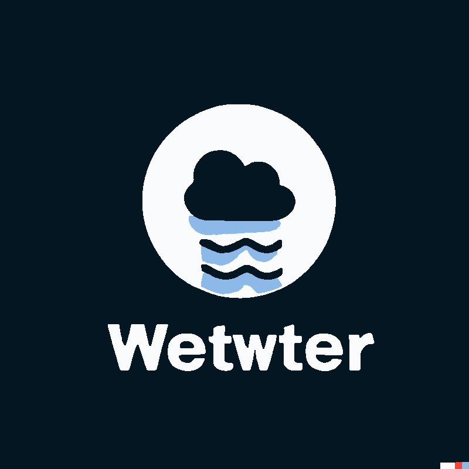
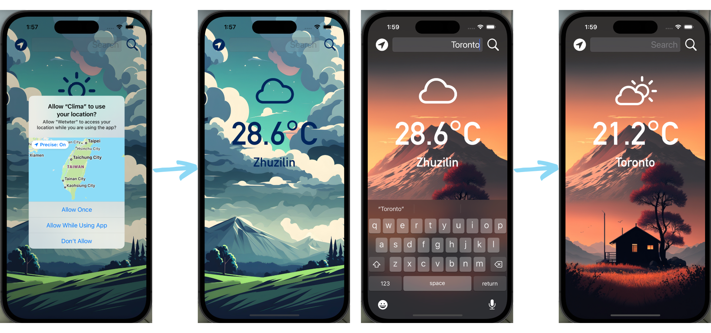

# Bitcon-iOS-Development-Bootcamp

<!--
*** Hello! I am currently practicing building iOS Apps.
*** This is my own modified version of ByteCoin from Angela Yu - The Complete iOS Development Bootcamp
-->


<!-- PROJECT LOGO -->
<div align="center">
  <a href="https://github.com/r1ddx2/Bitcon-iOS-Development-Bootcamp">
    
  </a>
<h3 align="center">Wetwter</h3>
  <p align="center">
    A real time weather app
  </p>
</div>


<!-- TABLE OF CONTENTS -->
<details>
  <summary>Table of Contents</summary>
  <ol>
    <li>
      <a href="#about-the-project">About The Project</a>
      <ul>
        <li><a href="#built-with">Built With</a></li>
      </ul>
     </li>
    <li><a href="#installation>Installation</a></li>
    <li><a href="#contact">Contact</a></li>
  </ol>
</details>


<!-- ABOUT THE PROJECT -->
## About The Project
<div align="center" style="display: inline-block;">
    


</div>

                                                              
                                                                                                                  
  </br>
 
  [Wetwter](https://github.com/r1ddx2/Wetwter-iOS-Development-Bootcamp) is a single view app that fetches the current weather temperature and condition through [OpenWeatherAPI](https://home.openweathermap.org/users/sign_in). <br>
  User can get the weather temperature and weather condition by pressing the core location button on the upper-left corner or by searching the city name. <br>
  I am currently learning iOS development and this is a simple practice on how to work with APIs. <br>
  This is a modified version of [Clima](https://github.com/appbrewery/Clima-iOS13). I did some adjustments on the user interface. 
  
### Built With

* [Swift](https://developer.apple.com/swift/)
            
<!-- INSTALLATION -->
## Installation
 
1. Get a free API Key at [OpenWeatherAPI](https://home.openweathermap.org/users/sign_in)
2. Clone the repo
   ```sh
   git clone https://github.com/github_username/repo_name.git
   ```
3. Navigate to "Clima/Model/WeatherAPI.swift" file
   ```sh
   cd Clima/Model/WeatherAPI.swift
   ```
4. Enter your API in `WeatherAPI.swift` and replace `YOUR_API_KEY`
5. Run the project
6. Press "Allow" for [Wetwter](https://github.com/r1ddx2/Wetwter-iOS-Development-Bootcamp) to access your location
            
 
           
            
            
            
<!-- CONTACT -->
## Contact

Red Wang 
- Email : r1ddx09@gmail.com
- Twitter: [@r1ddx](https://twitter.com/r1ddx) 
